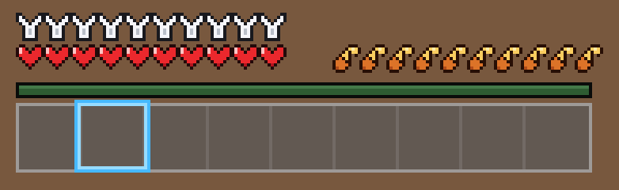

# Rolo PvP Pack (Minecraft 1.21.11)

A recreation of a PvP-style HUD texture pack, built for Minecraft Java
Edition 1.21.11 (uses the modern per-sprite GUI layout under
`assets/minecraft/textures/gui/sprites/hud/`, introduced in 1.20.2+).



## What it changes

| HUD element | Style |
|---|---|
| Armor bar | Bold silver/white "Y" icons (empty + half variants included) |
| Hearts | Flat bright red, dark outline, small highlight (blinking + container variants included) |
| Hunger bar | Orange drumsticks with a golden bone (hunger-effect variants included) |
| XP bar | Dark, muted green |
| Hotbar | Dark fill with light gray border and subtle slot dividers |
| Hotbar selection | Bright cyan/blue frame |

Item textures (sword, pickaxe, bow, crossbow, arrows) are left vanilla —
the screenshot's items are standard netherite/diamond tools.

## Install

1. Grab `rolo-pvp-pack-1.21.11.zip` (or zip the contents of
   `rolo-pvp-pack/` yourself — `pack.mcmeta` must be at the zip root).
2. Drop it into your `.minecraft/resourcepacks/` folder.
3. Enable it in **Options → Resource Packs**.

The `pack.mcmeta` declares a wide supported-format range
(`46`–`9999`, both legacy `supported_formats` and the newer
`min_format`/`max_format` keys), so it loads on 1.21.4 through 1.21.11+
without an "incompatible pack" warning. If a future version still flags
it, bump `pack_format` to that version's number.

## Rebuilding the textures

All sprites are drawn from ASCII pixel maps in `generate_textures.py`:

```sh
pip install pillow
python3 generate_textures.py
```

This regenerates `rolo-pvp-pack/`, `preview.png`, and the zip. Edit the
pixel maps or palette constants at the top of the script to tweak the look.
